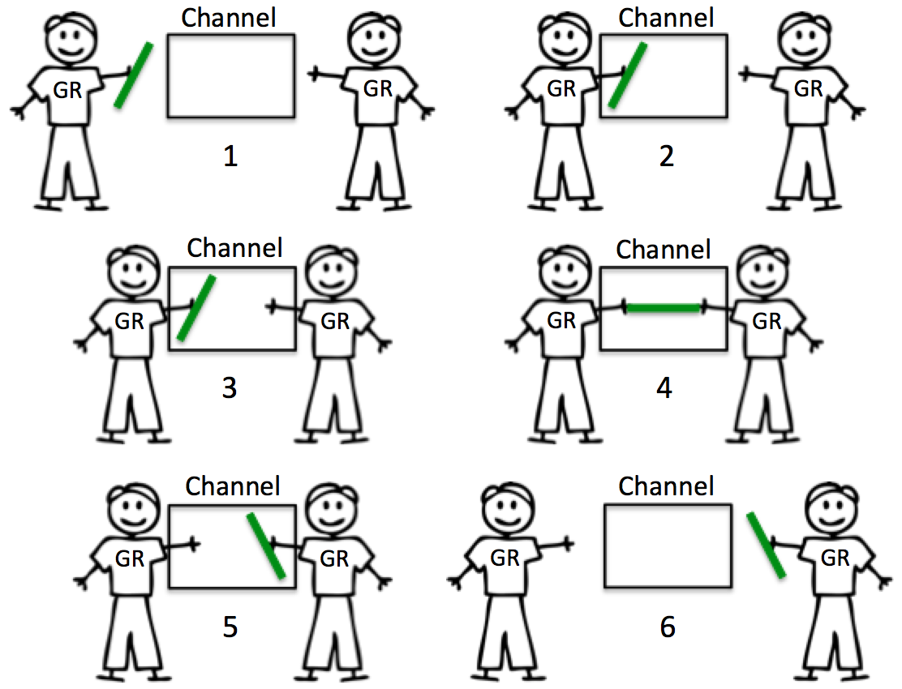

# 概述

**Go 箴言: 不要通过共享内存来通信，而要通过通信来共享内存。**

# 阻塞通道与非阻塞通道

通过关键字 `chan` + `数据类型` 来表明通道数据类型，调用 `make()` 函数来初始化一个通道。
`make()` 函数的第二个参数为通道长度，如果未指定或指定为 0，则该通道为非缓存通道 ([阻塞通道](channel.md)),
否则该通道为缓存通道 (非阻塞通道)。

# 非阻塞通道



## 例子

```go
ch := make(chan string, 10) // 非缓冲通道, 容量为 10
```

# 3 种操作

## 发送

- 如果通道已满 (元素数量达到容量), 发送操作将会阻塞，直到另一个 `goroutine` 在对应的通道上面完成接收操作，
  两个 `goroutine` 才可以继续执行
- 如果通道未满，发送操作不会阻塞

### 语法规则

```shell
通道变量 <- 数据

# 例如: 将变量 x 发送到通道 ch
ch <- x 
```

## 接收

- 如果通道已空 (元素数量为 0)，接收操作将会阻塞，直到另一个 `goroutine` 在对应的通道上面完成发送操作，
  两个 `goroutine` 才可以继续执行
- 如果通道不为空，接收操作不会阻塞

### 语法规则

```shell
<- 通道变量

# 例如: 从通道 ch 接收一个值，并且丢弃
<-ch 
````

```shell
接收变量 <- 通道变量

# 例如: 从通道 ch 接收一个值，并且赋值给变量 x
x := <-ch 
````

## 关闭

详情见 [关闭通道](channel_close.md)。

# 例子

## 缓存通道容量为 2

```go
package main

func main() {
	ch := make(chan string, 2)

	ch <- "hello" // 不会死锁，因为 ch 是缓冲通道
	ch <- "world"

	println(<-ch)
	println(<-ch)
}

// $ go run main.go
// 输出如下
/**
  hello
  world
*/
```