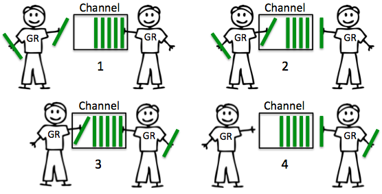

# 概述

建议先阅读 [goroutine](goroutine.md) 小节。

> Go 箴言: 不要通过共享内存来通信，而要通过通信来共享内存。

`goroutine` 是 Go 程序并发执行的实体，`channel (通道)` 则是它们之间的连接，用于多个 `goroutine` 之间互相通信。
通道可以让一个 `goroutine` 发送特定类型值到另一个 `goroutine`，每一个通道可以发送数据类型称为通道的 `元素类型`。

# 阻塞通道与非阻塞通道

通过关键字 `chan` + `数据类型` 来表明通道数据类型，调用 `make()` 函数来初始化一个通道。
`make()` 函数的第二个参数为通道长度，如果未指定或指定为 0，则该通道为非缓存通道 (阻塞通道),
否则该通道为缓存通道 ([非阻塞通道](channel_buffer.md))。

# 阻塞通道



## 例子

```go
ch := make(chan string) // 非缓冲通道
ch := make(chan string, 0) // 非缓冲通道
ch := make(chan string, 10) // 缓冲通道, 容量为 10
```

# 3 种操作

## 发送

无缓冲通道上面的发送操作将会阻塞，直到另一个 `goroutine` 在对应的通道上面完成接收操作，两个 `goroutine` 才可以继续执行。

### 语法规则

```shell
通道变量 <- 数据

# 例如: 将变量 x 发送到通道 ch
ch <- x 
```

## 接收

无缓冲通道上面的接收操作将会阻塞，直到另一个 `goroutine` 在对应的通道上面完成发送操作，两个 `goroutine` 才可以继续执行。

### 语法规则

```shell
<- 通道变量

# 例如: 从通道 ch 接收一个值，并且丢弃
<-ch 
````

```shell
接收变量 <- 通道变量

# 例如: 从通道 ch 接收一个值，并且赋值给变量 x
x := <-ch 
````

## 关闭

详情见 [关闭通道](channel_close.md)。

# 例子

## 搭配 goroutine

```go
package main

func main() {
	ch := make(chan string) // 没有设置通道的长度

	go func() {
		ch <- "hello world"
	}()

	msg := <-ch // 一直阻塞，直到接收到通道消息
	println(msg)
}

// $ go run main.go
// 输出如下
/**
  hello world
*/
```

## 死锁

```go
package main

func main() {
	ch := make(chan string) // 没有设置通道的长度

	ch <- "hello world" // 向通道发送数据，但是没有接收者

	msg := <-ch // 代码执行不到这里, 因为上面阻塞发送数据时，就已经死锁了
	println(msg)
}

// $ go run main.go
// 输出如下
/**
  fatal error: all goroutines are asleep - deadlock!

  ...
  ...

  exit status 2
*/
```

# 扩展阅读

1. [死锁 - 维基百科](https://zh.wikipedia.org/wiki/%E6%AD%BB%E9%94%81)