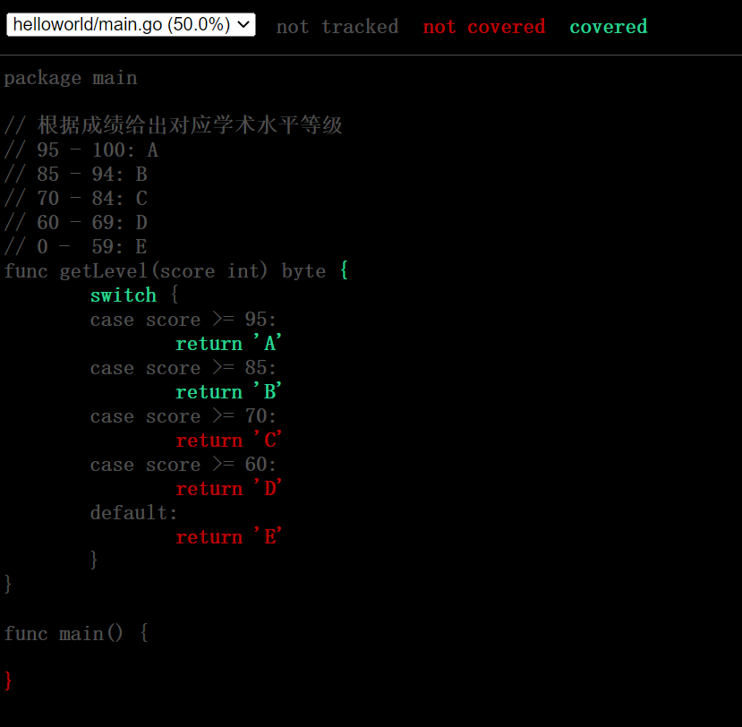
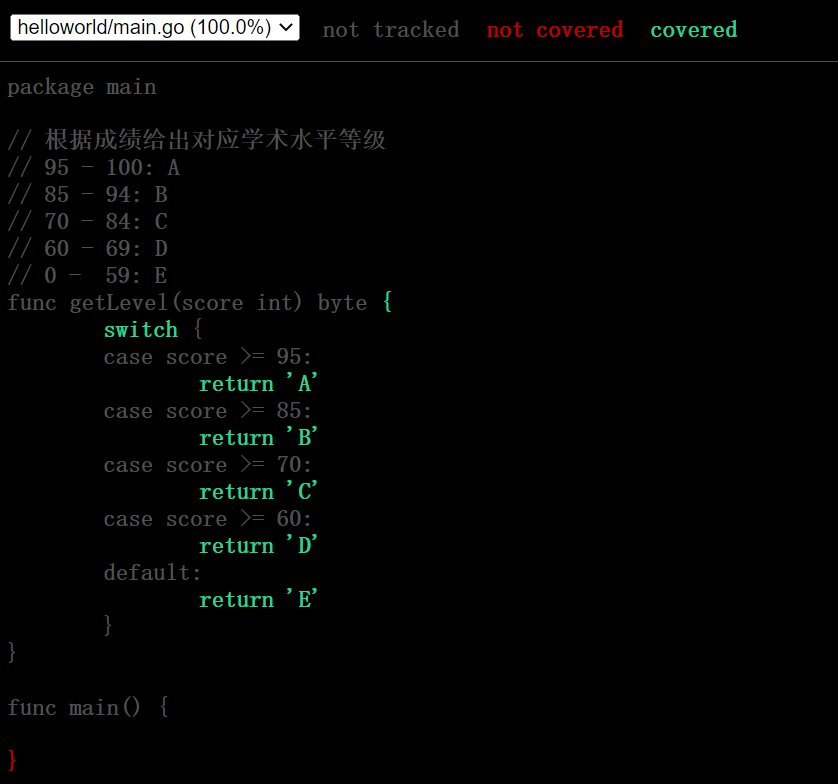

## 概念

> 测试覆盖率是指被测试对象被覆盖到的测试比例。

这里的测试对象包括程序中的语句、判定、分支、函数、对象，包等等。 `语句覆盖率` 是指部分语句在一次程序运行中至少执行过一次，是最简单且广泛使用的方法之一。
为了缩短篇幅，直奔主题，本小节的代码示例只演示 `语句覆盖率`，对测试理论感兴趣的读者可以参考 [附录3](#reference) 的链接。

## cover

> Go 内置的 cover 工具用来衡量语句覆盖率并帮助标识测试之间的明显差别，已经集成到了 `go test` 命令中。

```shell
$ go tool cover
Usage of 'go tool cover':
Given a coverage profile produced by 'go test':
    go test -coverprofile=c.out
...
...
Only one of -html, -func, or -mode may be set.
``` 

通过输出信息可以看到，将测试结果存入一个文件中，可以使用 `go tool cover` 命令可视化查看生成的代码测试覆盖率。

## 示例

### 测试覆盖率 - 1

这里写一个简单的函数，作为示例，将如下代码写入 `main.go` 文件中:

```go
package main

// 根据成绩给出对应学术水平等级
// 95 - 100: A
// 85 - 94: B
// 70 - 84: C
// 60 - 69: D
// 0 -  59: E
func getLevel(score int) byte {
	switch {
	case score >= 95:
		return 'A'
	case score >= 85:
		return 'B'
	case score >= 70:
		return 'C'
	case score >= 60:
		return 'D'
	default:
		return 'E'
	}
}

func main() {

}
```

将如下的测试代码写入 `main_test.go` 文件中:

```go
package main

import "testing"

func Test_getLevel(t *testing.T) {
	tests := []struct {
		score int
		want  byte
	}{
		// 先写 3 个基础的测试用例，演示一下测试覆盖
		{
			100,
			'A',
		},
		{
			95,
			'A',
		},
		{
			94,
			'B',
		},
	}
	for _, tt := range tests {
		if got := getLevel(tt.score); got != tt.want {
			t.Errorf("getLevel() = %v, want %v", got, tt.want)
		}
	}
}
```

先看看测试是否通过:

```shell
$ go test -v -count=1 .
# 测试通过
=== RUN   Test_getLevel
--- PASS: Test_getLevel (0.00s)
PASS
ok      helloworld      0.001s
```

测试通过后，可以将测试结果存入 `-coverprofile` 参数指定的文件中:

```shell
$ go test -v -count=1 -coverprofile=c.out  .
# 输出如下，可以看到测试覆盖率为 50%
=== RUN   Test_getLevel
--- PASS: Test_getLevel (0.00s)
PASS
coverage: 50.0% of statements
ok      helloworld      0.001s  coverage: 50.0% of statements
```

最后，可以由 `-html` 参数指定 `c.out` 生成一个可视化的 .html 报告文件

```shell
$ go tool cover -html=c.out
# HTML output written to /tmp/cover1955546776/coverage.html
# 浏览器打开 /tmp/cover1955546776/coverage.html 文件
```

页面显示如下



在打开的 HTML 界面中，**左上角给出了总的测试覆盖率，绿色标记的语句块表示它被覆盖了，而红色标记的语句块表示它没有被覆盖**。

### 测试覆盖率 - 2

接下来增加一些测试用例，然后看看测试覆盖率有什么变化。

将如下的测试代码写入 `main_test.go` 文件中:

```go
package main

import "testing"

func Test_getLevel(t *testing.T) {
	tests := []struct {
		score int
		want  byte
	}{
		{
			100,
			'A',
		},
		{
			95,
			'A',
		},
		{
			94,
			'B',
		},
		{
			84,
			'C',
		},
		{
			70,
			'C',
		},
		{
			60,
			'D',
		},
		{
			50,
			'E',
		},
	}
	for _, tt := range tests {
		if got := getLevel(tt.score); got != tt.want {
			t.Errorf("getLevel() = %v, want %v", got, tt.want)
		}
	}
}
```

先看看测试是否通过:

```shell
$ go test -v -count=1 .
# 测试通过
=== RUN   Test_getLevel
--- PASS: Test_getLevel (0.00s)
PASS
ok      helloworld      0.001s
```

测试通过后，可以将测试结果存入 `-coverprofile` 参数指定的文件中:

```shell
$ go test -v -count=1 -coverprofile=c.out  .
# 输出如下，可以看到测试覆盖率为 100%
=== RUN   Test_getLevel
--- PASS: Test_getLevel (0.00s)
PASS
coverage: 100.0% of statements
ok      helloworld      0.001s  coverage: 100.0% of statements
```

最后，可以由 `-html` 参数指定 `c.out` 生成一个可视化的 .html 报告文件

```shell
$ go tool cover -html=c.out
# HTML output written to /tmp/cover3170627496/coverage.html
# 浏览器打开 /tmp/cover3170627496/coverage.html 文件
```

页面显示如下



从上面的测试覆盖率图中可以看到，现在的测试覆盖率已经达到 100%, 也就是说，`getLevel` 函数中的每个语句都覆盖到了。

## 100% 的测试覆盖率

在上面的简单示例中，测试覆盖率达到了 100%, 这个看上去很完美，但是实际开发中基本不可行，主要原因在于:

- 语句被覆盖执行并不能说明其没有 `Bug`
- 测试用例代码不能一味追求覆盖率，编写测试的成本会随着代码覆盖率增长而增加

覆盖工具可以帮助识别程序中最薄弱的地方，但更重要的是通过精心设计测试用例，在编写测试代码和尽可能高的覆盖率之间找到平衡。

## 测试覆盖率计算简单原理

实现测试覆盖率最简单的办法是修改源代码，在每个语句块执行之前，设置 1 个 `bool 变量` 作为该语句块是否执行的标识。
在程序退出之前，将所有 `bool 变量` 的值写入到指定的文件中并输出汇总信息。

# 小结

本小节首先介绍了测试覆盖率的一些基础理论，然后使用一个简单的小例子，演示了如何生成测试覆盖率和可视化文件，最后总结了测试覆盖率在工程中的一些实践经验。

# Reference

1. [测试覆盖率 - 维基百科](https://zh.wikipedia.org/zh-hans/%E6%B8%AC%E8%A9%A6%E8%A6%86%E8%93%8B%E7%8E%87)
2. [Go 圣经](https://book.douban.com/subject/27044219/)
3. [测试覆盖率 - 博客园](https://www.cnblogs.com/Neeo/articles/11795996.html)