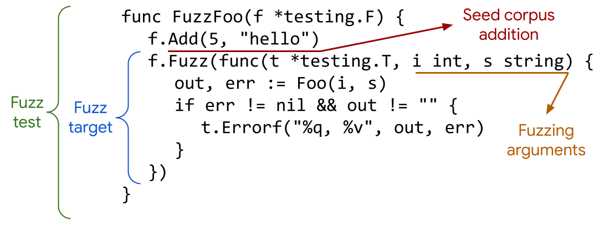

# 概述

Go 从 `1.18` 版本开始在内置标准工具链中支持原生 `模糊测试` [OSS-Fuzz](https://google.github.io/oss-fuzz/getting-started/new-project-guide/go-lang/#native-go-fuzzing-support) 。

`模糊测试` 是一种自动化测试技术，它不断生成输入用以查找程序的 `Bug`。`模糊测试` 使用覆盖率报告智能地遍历被测试的代码，查找并向用户报告问题。
`模糊测试` 可以覆盖开发人员经常忽视的边缘场景，因此对于发现系统的安全漏洞和薄弱环节价值巨大。

下面是一个模糊测试的例子，主要组成就是高亮部分:



# 编写模糊测试

## 必要条件

**模糊测试必须遵守下列规则**:

- 模糊测试必须是一个以 `Fuzz` 为前缀的函数，仅有一个类型为 `*testing.F` 的参数，并且没有返回值
- 模糊测试必须在 `*_test.go` 文件中才可以运行
- 模糊测试目标必须是调用 `(*testing.F).Fuzz` 函数，该函数第一个参数类型为 `*testing.T`, 后面跟模糊测试参数，没有返回值
- 每个模糊测试必须有一个目标
- 所有种子语料库条目的类型必须与模糊测试参数以及顺序相同，对于调用 `(*testing.F).Add` 和模糊测试的 `testdata/fuzz` 目录中的任何语料库文件都是如此
- 模糊参数只能是以下数据类型:
    - `string, []byte`
    - `int, int8, int16, int32/rune, int64`
    - `uint, uint8/byte, uint16, uint32, uint64`
    - `float32, float64`
    - `bool`

## 建议

下面是一些帮助你充分利用模糊测试的建议:

- **模糊测试目标应该是快速且确定的**，这样模糊测试引擎才能高效工作，并且可以轻松复现新的故障和代码覆盖率
- 由于模糊测试目标是在多个 `worker` 之间以不确定的顺序运行的，因此 **模糊测试目标的状态不应该持续到每次调用结束**，并且模糊测试目标的行为不应该依赖全局状态

# 运行模糊测试

有两种运行模糊测试的方式：作为单元测试（默认 `go test`）或模糊测试（`go test -fuzz=FuzzTestName`）。

默认情况下，模糊测试的运行方式与单元测试非常相似。每个种子语料库条目都将针对模糊测试目标进行测试，如果有失败的测试，会在退出前报告。

要启用模糊测试，请使用 `-fuzz` 标志运行 `go test`，参数为匹配模糊测试函数名的正则表达式。默认情况下，该包中的所有其他测试都将在模糊测试开始之前运行。

默认情况下，模糊测试发生错误时会停止运行，如果没有发生错误，可能会无限运行下去，这时可以使用参数 `-fuzztime` 来设置运行时间，例如 `go test -fuzz=Fuzz -fuzztime=10s .`。

注意：**模糊测试应该在支持覆盖检测的平台（目前是 `AMD64` 和 `ARM64`）上运行**，这样语料库可以在运行时有意义地增长，并且可以在模糊测试时覆盖更多代码。

## 命令行输出

在进行模糊测试时，模糊测试引擎会生成新的输入，并运行提供的模糊测试目标。默认情况下，它会一直运行，直到发现输入失败或用户取消测试过程（例如使用 `Ctrl+C`）。

输出格式大致如下:

```shell
$ go test -fuzz FuzzFoo
fuzz: elapsed: 0s, gathering baseline coverage: 0/192 completed
fuzz: elapsed: 0s, gathering baseline coverage: 192/192 completed, now fuzzing with 8 workers
fuzz: elapsed: 3s, execs: 325017 (108336/sec), new interesting: 11 (total: 202)
fuzz: elapsed: 6s, execs: 680218 (118402/sec), new interesting: 12 (total: 203)
fuzz: elapsed: 9s, execs: 1039901 (119895/sec), new interesting: 19 (total: 210)
fuzz: elapsed: 12s, execs: 1386684 (115594/sec), new interesting: 21 (total: 212)
PASS
ok      foo 12.692s
```

第一行表示在模糊测试开始之前收集了 `基线覆盖率`。

为了收集 `基线覆盖率`，模糊引擎执行种子语料库和生成的语料库，以确保没有错误发生，并了解现有语料库已经提供的代码覆盖率。

下面几行是对主动执行模糊测试的说明:

- **elapsed**: 模糊测试运行时间
- **execs**: 针对模糊测试目标运行的输入总数（自上一条日志行以来的平均 execs/sec）
- **new** interesting: 在此模糊执行期间添加到生成的语料库中的“有趣”输入的总数（整个语料库的总大小）

## 输入失败

模糊测试可能会因为下列原因失败:

- 代码或测试中发生 `panic`
- 模糊测试目标直接或间接通过 `t.Error` 或 `t.Fatal` 调用了 `t.Fail` 方法
- 发生了不可恢复的错误，例如 `os.Exit` 或堆栈溢出
- 模糊测试目标花费的时间太长，导致无法完成。目前执行模糊测试目标的超时时间为 `1 秒`，这可能会因为死锁、无限循环、代码中的预期行为而失败， 这也是为什么建议模糊测试目标运行要尽可能地快的原因之一

如果发生错误，模糊引擎将尝试将输入最小化为最小可能和最易读的值，这仍然会产生错误。请参阅 [自定义配置](#自定义配置) 部分。

最小化完成后，将记录错误消息，输出将以如下内容结尾：

```shell
 Failing input written to testdata/fuzz/FuzzFoo/a878c3134fe0404d44eb1e662e5d8d4a24beb05c3d68354903670ff65513ff49
    To re-run:
    go test -run=FuzzFoo/a878c3134fe0404d44eb1e662e5d8d4a24beb05c3d68354903670ff65513ff49
FAIL
exit status 1
FAIL    foo 0.839s
```

模糊引擎将这个失败的输入写入该模糊测试的种子语料库，现在它将默认运行 `go test`，一旦错误被修复，它就会作为回归测试。

下一步是诊断问题、修复错误、通过重新运行 `go test` 来验证修复，并提交带有新测试数据文件的补丁作为您的回归测试。

# 自定义配置

默认的 go 命令适用于大多数模糊测试用例。所以典型的一个模糊化运行命令应该是这样的：

```shell
$ go test -fuzz={FuzzTestName}
```

`go 命令` 提供了一些设置来运行模糊测试，具体的文档请参考 [cmd/go](https://pkg.go.dev/cmd/go)。

重点说几个:

- **-fuzztime**: 模糊测试目标在退出前执行的总时间或迭代次数，默认是无限执行
- **-fuzzminimizetime**: 在每次最小化尝试期间模糊目标将执行的时间或迭代次数，默认 `60 秒`，可以通过参数 `-fuzzminimizetime=0` 禁用
- **-parallel**: 同时运行的模糊测试进程数，默认为 `$GOMAXPROCS`，目前，在模糊测试期间设置 `-cpu` 无效

# 语料库文件格式

语料库文件以特殊格式编码，种子语料库和生成的语料库都是相同的格式。

下面是一个典型的语料库文件：

```shell
$ go test fuzz v1
[]byte("hello\\xbd\\xb2=\\xbc ⌘")
int64(572293)
```

以下每一行都是构成语料库条目的值，如果需要，可以直接复制到 Go 代码中。

在上面的示例中，我们有一个 `[]byte` 后跟一个 `int64`。这些类型必须按顺序与模糊测试参数完全匹配。这些类型的模糊测试目标如下所示：

```shell
f.Fuzz(func(*testing.T, []byte, int64) {})
```

指定自己的种子语料库值，最简单方法是使用 `(*testing.F).Add` 方法。例如像这样：

```shell
f.Add([]byte("hello\\xbd\\xb2=\\xbc ⌘"), int64(572293))
```

但是，对于大型二进制文件，不希望将其作为代码复制到测试中，而是作为单独的种子语料库条目保留在 testdata/fuzz/{FuzzTestName} 目录中。
`file2fuzz` 工具可用于将这些二进制文件转换为编码为 []byte 的语料库文件。

```shell
# 安装和使用 file2fuzz
$ go install golang.org/x/tools/cmd/file2fuzz@latest
$ file2fuzz
```

# 资源

## 教程

- [Tutorial: Getting started with fuzzing](https://go.dev/doc/tutorial/fuzz)

## 文档

- [testing 包](https://pkg.go.dev//testing#hdr-Fuzzing) 描述了编写模糊测试时使用的 testing.F 类型
- [cmd/go 包](https://pkg.go.dev/cmd/go) 描述与模糊测试相关的标志

## 技术细节

- [设计方案](https://golang.org/s/draft-fuzzing-design)
- [提案](https://golang.org/issue/44551)

# 术语表

- corpus entry: 在模糊测试时使用的 `语料库输入条目`，可以是特殊格式的文件，或者调用 `(*testing.F).Add` 添加
- coverage guidance: `一种模糊测试方法`，它使用代码覆盖范围的扩展来确定哪些语料库条目值得保留，以备将来使用
- failing input: 失败的输入是 `一个语料库条目`，在针对模糊测试目标运行时会导致错误或恐慌
- fuzz target: 在模糊测试时对语料库条目和生成的值 `执行模糊测试的函数`。它通过将函数传递给 (*testing.F).Fuzz 来提供给模糊测试
- fuzz test: 一个格式为 `func FuzzXxx(*testing.F)` 并且在 `test 文件中的函数`，用于模糊测试
- fuzzing: `一种自动测试类型`，它不断地修改程序的输入，以发现代码可能易受影响的问题，如错误或漏洞
- fuzzing arguments: `传递到模糊目标的类型`，并且可以被 mutator 修改变异
- fuzzing engine: `一种管理模糊测试的工具`，包括维护语料库、调用修改器、识别新覆盖范围和报告失败
- generated corpus: `由模糊引擎随时间维护的语料库`，以跟踪进度。它存储在 `$GOCACHE/fuzz` 中，这些条目仅在模糊测试时使用
- mutator: `模糊测试时使用的一种工具`，在将语料库条目传递给模糊测试目标之前，`随机操作语料库条目`
- package: 同一目录中一起编译的源文件的集合
- seed corpus: `用户提供的模糊测试语料库`，可用于指导模糊引擎。它由 fuzz 测试中的 f.Add 调用提供的语料库条目和包内
  testdata/fuzz/{FuzzTestName} 目录中的文件组成。这些条目默认使用 go test 运行，无论是否进行模糊测试
- test file: xxx_test.go 格式的文件，可能包含功能测试、基准测试、示例、模糊测试
- vulnerability: 代码中可被攻击者利用的薄弱环节

# 反馈

如果您遇到任何问题或对某个功能有想法，[请提出问题](https://github.com/golang/go/issues/new?&labels=fuzz)。

有关该功能的讨论和一般反馈，您还可以参与 `Gophers Slack` 中的 [#fuzzing 频道](https://gophers.slack.com/archives/CH5KV1AKE)。

# Reference

1. [原文](https://go.dev/security/fuzz/)