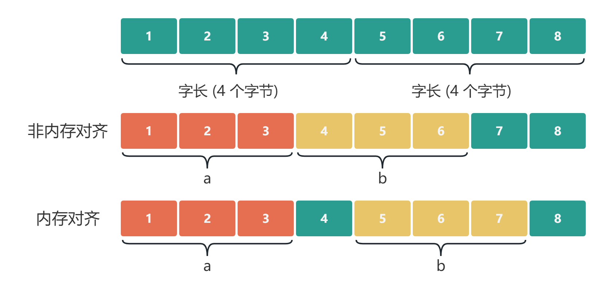

# 概述

**内存对齐**，或者说字节对齐，指代码编译后在内存的布局与使用方式。现代计算机一般是 `32位` 或 `64位` 地址对齐，如果要访问的变量内存没有对齐，可能会触发总线错误。
[维基百科](https://zh.wikipedia.org/wiki/%E6%95%B0%E6%8D%AE%E7%BB%93%E6%9E%84%E5%AF%B9%E9%BD%90)。

# 为什么需要内存对齐

**CPU 访问内存时，并不是逐个字节访问，而是以字长（word size）为单位访问**。比如 32 位的 CPU ，字长为 4 字节，那么 CPU 访问内存的单位也是 4 字节。
这么设计的目的，是减少 CPU 访问内存的次数，提升 CPU 访问内存的吞吐量。比如同样读取 8 个字节的数据，一次读取 4 个字节那么只需要读取 2 次。

CPU 始终以字长访问内存，如果不进行内存对齐，很可能增加 CPU 访问内存的次数，例如：



变量 a、b 各占据 3 字节的空间，内存对齐后，a、b 占据 4 字节空间，CPU 读取 b 变量的值只需要进行一次内存访问。
如果不进行内存对齐，CPU 读取 b 变量的值需要进行 2 次内存访问。第一次访问得到 b 变量的第 1 个字节，第二次访问得到 b 变量的后两个字节。

从这个例子中也可以看到，内存对齐对实现变量的原子性操作也是有好处的，每次内存访问是原子的，如果变量的大小不超过字长，那么内存对齐后，
对该变量的访问就是原子的，这个特性在并发场景下至关重要。

> 内存对齐可以提高内存读写性能，并且便于实现原子性操作。

# 内存对齐带来的影响

内存对齐提升性能的同时，也需要付出相应的代价。由于变量与变量之间增加了填充，并没有存储真实有效的数据，所以 **占用的内存会更大**，这也是典型的 `空间换时间` 策略。

# 对齐规则

| 类型                              | 大小                           |
|---------------------------------|------------------------------|
| `bool`                          | 1 个字节                        |
| `intN, uintN, floatN, complexN` | N / 8个字节（例如 float64 是 8 个字节） |
| `int, uint, uintptr`            | 1 个字                         |
| `*T`                            | 1 个字                         |
| `string`                        | 2 个字 （数据、长度）                 |
| `[]T`                           | 3 个字 （数据、长度、容量）              |
| `map`                           | 1 个字                         |
| `func`                          | 1 个字                         |
| `chan`                          | 1 个字                         |
| `interface`                     | 2 个字 （类型、值）                  |

字长为 4 字节时，1 个字就是 4 字节，字长为 8 字节时，1 个字就是 8 字节。

# 内存未对齐

```go
package performance

import (
	"testing"
)

// 占用 32 个字节
type person struct {
	hasMoney bool   // 1 个字节
	name     string // 16 个字节
	age      int16  // 2 个字节
}

func Benchmark_Alignment(b *testing.B) {
	b.ResetTimer()

	for i := 0; i < b.N; i++ {
		_ = make([]person, b.N)
	}
}
```

- **hasMoney** 是第 1 个字段，对齐倍数 1，默认已经对齐，从位置 0 开始占据 1 个字节
- **name**     是第 2 个字段，对齐倍数 8，因此空出了 7 个字节 (1 - 7)，从位置 8 开始占据 16 个字节，正好对齐填充满
- **age**      是第 3 个字段，对齐倍数 2，此时内存已经对齐了，从位置 24 开始占据 2 个字节

> hasMoney (1 个字节) + 空出的 (7 个字节) + name (16 个字节) + age (2 个字节) + 末尾对齐 (6 个字节) = 32 个字节


运行测试，并将基准测试结果写入文件:

```shell
# 运行 10000 次，统计内存分配
$ go test -run='^$' -bench=. -count=1 -benchtime=10000x -benchmem > slow.txt
```

# 内存对齐

```go
package performance

import (
	"testing"
)

// 占用 24 个字节
type person struct {
	name     string // 16 个字节
	age      int16  // 2 个字节
	hasMoney bool   // 1 个字节
}

func Benchmark_Alignment(b *testing.B) {
	b.ResetTimer()

	for i := 0; i < b.N; i++ {
		_ = make([]person, b.N)
	}
}
```

- **name**      是第 1 个字段，对齐倍数 8，默认已经对齐，从位置 0 开始占据 16 个字节
- **age**       是第 2 个字段，对齐倍数 2，此时内存已经对齐了，从位置 16 开始占据 2 个字节
- **hasMoney**  是第 3 个字段，对齐倍数 1，此时内存已经对齐了，从位置 18 开始占据 1 个字节

> name (16 个字节) + age (2 个字节) + hasMoney (1 个字节) + 末尾对齐 (5 个字节) = 24 个字节


运行测试，并将基准测试结果写入文件:

```shell
# 运行 1000 次，统计内存分配
$ o test -run='^$' -bench=. -count=1 -benchtime=10000x -benchmem > fast.txt
```

# 使用 benchstat 比较差异

```shell
$ benchstat -alpha=100 slow.txt fast.txt 

# 输出如下:
name          old time/op    new time/op    delta
_Alignment-8    18.1µs ± 0%    15.2µs ± 0%  -15.80%  (p=1.000 n=1+1)

name          old alloc/op   new alloc/op   delta
_Alignment-8     328kB ± 0%     246kB ± 0%  -25.00%  (p=1.000 n=1+1)

name          old allocs/op  new allocs/op  delta
_Alignment-8      1.00 ± 0%      1.00 ± 0%     ~     (all equal)
```

输出的结果分为了三行，分别对应基准期间的: 运行时间、内存分配总量、内存分配次数，采用了 `内存对齐` 方案后:

- 运行时间提升了 `15%`
- 内存分配优化了 `25% `

因为时间关系，基准测试只运行了 10000 次，运行次数越大，优化的效果越明显。感兴趣的读者可以将 `-benchtime` 调大后看看优化效果。

# 空结构体

在 [空结构体](empty_struct.md) 小节中，我们谈到过 空结构体 `struct{}` 大小为 0。当结构体中字段的类型为 `struct{}` 时，
一般情况下不需要内存对齐。但是有一种情况例外：**当最后一个字段类型为 `struct{}` 时，需要内存对齐**。

如果内存没有对齐，同时有指针指向结构体最后一个字段, 那么指针对应的的地址将到达结构体之外，虽然 Go 保证了无法对该指针进行任何操作
(避免安全问题)，但是如果该指针一直存活不释放对应的内存， 就会产生内存泄露问题（指针指向的内存不会因为结构体释放而释放）。

一个良好实践是: **不要将 `struct{}` 类型的字段放在结构体的最后**，这样可以避免 `内存对齐` 带来的占用损耗。

## 内存对齐造成的额外占用

```go
package main

import (
	"fmt"
	"unsafe"
)

type t1 struct {
	x int32
	y struct{}
}

type t2 struct {
	y struct{}
	x int32
}

func main() {
	fmt.Printf("size = %d\n", unsafe.Sizeof(t1{}))
	fmt.Printf("size = %d\n", unsafe.Sizeof(t2{}))
}
```

```shell
$ go run main.go

# 输出如下
size = 8
size = 4
```

通过将 `struct{}` 类型的字段从最后一个换到第一个，避免了 `内存对齐`，节省了一半的内存使用量。

# 问题

Q: 编译器会在编译时自动内存对齐吗？

A: 会自动对齐，但是不会进行优化，也就是不会修改字段顺序，减少内存的使用。

Q: 为什么编译器不在编译时进行优化，通过修改结构体字段顺序，优化内存使用呢？

A: 如果修改了结构体字段顺序，在数据传输的时候，无法正确读取到结构体的数据。

# 小结

> 结构体类型时刻牢记内存对齐。

# Reference

- [极客兔兔](https://geektutu.com/post/hpg-struct-alignment.html)
