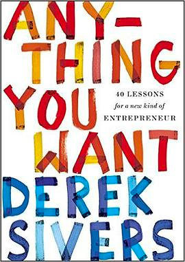

# 这本书是写什么的？

这是一本 Go 语言快速入门手册，目标读者是有任一编程语言基础，希望以最快的时间 (比如一个周末) 入门 Go 语言。

# 这本书应该怎么读？

书中几乎没有较长篇幅的理论知识，更多的是 `示例驱动开发`，鼓励读者通过快速实践加深基础理解，加快学习速度。
全书按照章节顺序阅读即可，其中一些需要前置知识的小节都会有备注信息。

# 这本书有什么特别的？

在学习 Go 语言的初期，笔者几乎阅读了网络上所有人气较高的 `Go 入门书籍` 和 `Go 入门教程`，但是这些资料或多或少存在以下问题: 
- 内容存在过多的概念描述，代码缺失严重
- 示例代码碎片化，对初学者不友好
- 章节编排不合理，开篇就讲各种配置、环境变量等
- 低级错误，如错别字，代码 Bug

当然，这些 `问题` 是因人而异的，上面所说只是笔者的一家之言，欢迎拍砖。

本书尽可能地规避以上问题，努力使读者达到 `最少量代码理解更多概念`。 笔者在梳理和编排内容的过程中，尽可能地将 `Go 知识点` 全面覆盖，
但是由于时间问题，忽略了一些语法、技术点的细节， 这是本书目前的不足之处。如果读者遇到问题，可以联系笔者随时指出。

# 为什么要写这本书？

这本书并非专门编写，而是笔者在整理笔记的过程中突发奇想: 
为什么不将碎片笔记提炼总结, 输出为系统性的体系知识内容呢？
这样不仅提高了自身的写作能力，同时可以体验分享知识的感觉，
能够认识新朋友，一起交流，共同进步 :)

# 关于分享这件事情

笔者分享的动力和勇气，主要受到了这两本书的影响。《Anything You Want》 里面的一句话:

> 你觉得非常普通的东西，在别人看起来可能非常厉害！

让笔者对分享有了非常强烈的兴趣和动力。 而另外一本《Show Your Work》, 
则给了笔者非常大的勇气开始行动，正如书中所说: 

> 你不需要是个天才，才有资格分享知识。

# 最后想说的话

写作的过程无疑是极具挑战性的，所有理论概念和示例代码，要站在读者的视角，在尽可能准确的前提下，
清晰地表达出来。不过也正因为如此，笔者才真正体会到 `费曼学习法` 的高效之处。
书的内容是对自己知识体系的整理成果，是经过思考后形成的结构化框架，最后分享给读者所获得的认同、
交流、批评，更是额外的收获。

# 扩展阅读
1. [Show Your Work](https://book.douban.com/subject/25857796/)
2. [Anything You Want](https://book.douban.com/subject/26979259/)

# 作者微信

